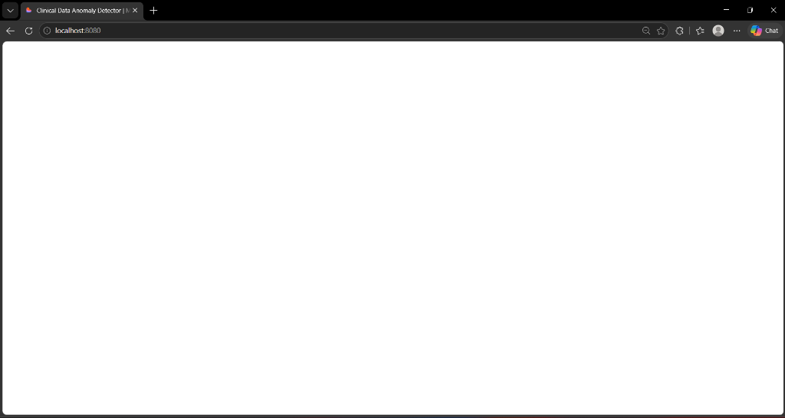
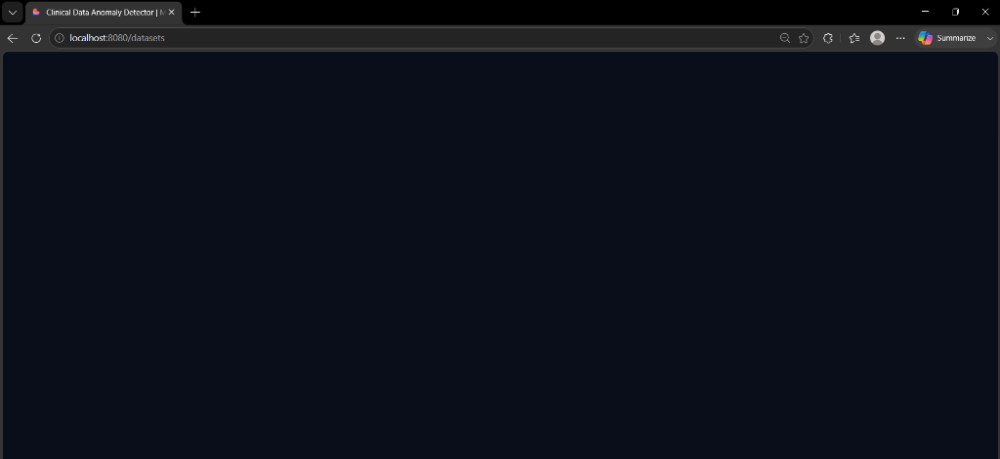
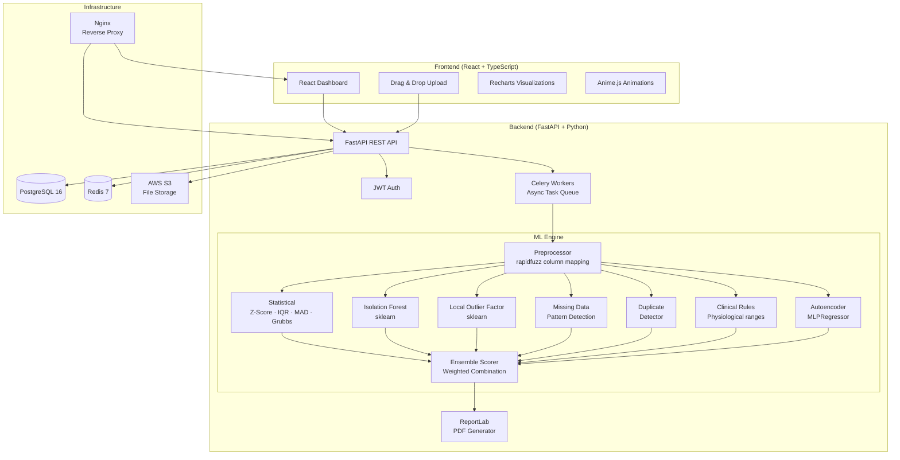

# 🧬 Clinical Data Anomaly Detector

> **ML-powered data quality for clinical trials** — Upload a clinical CSV, detect anomalies with 6 algorithms, export a compliance-ready PDF report.

[](https://python.org)
[](https://fastapi.tiangolo.com)
[](https://react.dev)
[](https://typescriptlang.org)
[](https://postgresql.org)
[](https://docker.com)
[](https://aws.amazon.com)
[](LICENSE)
[](https://github.com/storm-sudo/clinical-anomaly-detector/actions)

---

## 📖 Overview

Clinical trials generate massive, complex datasets where a single data entry error can compromise the integrity of an entire study — or worse, patient safety. This tool automates what clinical data managers do manually: finding outliers, impossible values, missing data patterns, and protocol deviations.

**Why this matters**: Regulatory agencies (FDA, EMA) require sponsors to demonstrate data integrity. ALCOA+ principles mandate that clinical data is Attributable, Legible, Contemporaneous, Original, Accurate — and more. This tool automates the quality check layer.

```
Upload CSV → 6 ML Algorithms Run in Parallel → Anomalies Ranked by Severity → PDF Report
```

---

## 📱 User Interface & Visual Tour

The application features a premium, Apple-inspired minimalist **Cream and Black** design system. It is clean, responsive, and optimized for clinical research professionals.

### 📊 Executive Dashboard
Overview of your clinical trials, datasets, algorithm runs, and overall quality trends.


### 🔍 Analysis Details & Outliers
In-depth inspection of datasets, showing the overall quality score ring, actionable recommendations, and anomaly distribution charts.


---

## 🏗️ Architecture



---

## 🤖 ML Algorithms — Plain English

### 1. 📊 Statistical Methods (Z-Score, IQR, Modified Z-Score, Grubbs)

**What it does**: Classic statistical outlier detection on each column independently.

- **Z-Score**: Measures how many standard deviations a value is from the mean. A hemoglobin of 2.1 g/dL when the mean is 13.5 (std=1.2) produces a Z-score of -9.5 — clearly impossible.
- **IQR**: Defines a "fence" using quartiles. Anything below Q1 - 1.5×IQR or above Q3 + 1.5×IQR is an outlier. Robust to skewed distributions.
- **Modified Z-Score (MAD)**: Uses median instead of mean — even more robust for clinical data that often has non-normal distributions.
- **Grubbs Test**: Formal statistical test for detecting a single outlier in normally distributed data.

**Best for**: Per-column outliers, lab value anomalies, vital sign spikes.

### 2. 🌲 Isolation Forest

**What it does**: ML algorithm that isolates anomalies instead of profiling normal data. Builds random decision trees and measures how quickly each data point gets "isolated."

**Key insight**: Anomalies are rare and different — they need fewer splits to isolate. A patient row where 8 lab values are all simultaneously extreme gets isolated in just 2-3 splits, while normal rows take 15+ splits.

**Best for**: Multi-column patterns — detecting rows that are anomalous across multiple measurements simultaneously. Ideal for catching copy-paste errors across rows.

### 3. 🗺️ Local Outlier Factor (LOF)

**What it does**: Compares the local density of a data point to the densities of its k nearest neighbors. A point in a sparse region relative to its neighbors is an outlier.

**Key insight**: Clinical data has natural clusters (e.g., patients grouped by age/weight/disease severity). LOF detects anomalies *within each cluster*, not just globally.

**Best for**: Clinical datasets with subgroup structure. Detects a 70-year-old patient whose lab values would be normal for a 30-year-old.

### 4. 🕳️ Missing Data Analysis

**What it does**: Detects missing data patterns that violate clinical trial protocol requirements.

- **Rate analysis**: Columns with >5% missing are HIGH severity; >20% is CRITICAL — strict GCP requirements mandate completeness.
- **Impossible values**: Negative weights, heart rates > 300, temperatures < 32°C — values that cannot physically exist.
- **Subject streak detection**: Patients missing 3+ consecutive visits (often indicates early dropout, a critical endpoint in survival studies).

**Best for**: ICH E6 GCP compliance checks, protocol deviation detection.

### 5. 🔁 Duplicate Detection

**What it does**: Finds exact and near-duplicate rows that indicate data quality issues.

- **Exact duplicates**: Identical rows across all columns — classic ETL errors.
- **Same-subject copy-paste**: Same value repeated across all timepoints for a patient — common transcription error in EDC systems.

**Best for**: Catching EDC (Electronic Data Capture) system data entry errors.

### 6. 🏥 Clinical Rules Engine

**What it does**: Domain-specific validation rules based on physiological knowledge and clinical trial protocol.

Built-in ranges for 20+ clinical parameters:

| Parameter | Physiological Range | Critical Alert |
|-----------|--------------------|-|
| Hemoglobin | 7.0 – 20.0 g/dL | < 5.0 or > 22.0 |
| Sodium | 110 – 170 mEq/L | < 100 or > 180 |
| ALT | 0 – 5000 U/L | > 3× ULN → potential hepatotoxicity |
| Systolic BP | 50 – 250 mmHg | < 40 or > 300 |
| Heart Rate | 20 – 250 bpm | < 10 or > 300 |
| Temperature | 32.0 – 43.0 °C | > 42 → hyperpyrexia |

Cross-field checks:
- Systolic BP must always exceed diastolic BP
- End date must be ≥ Start date
- Weight change >20% between consecutive visits = potential transcription error
- Lab value >3× between consecutive visits = suspicious change

**Best for**: Catching clinically impossible values that pass statistical tests (e.g., a sodium of 165 isn't a statistical outlier but is a medical emergency).

### 7. 🧠 Autoencoder (MLPRegressor-based)

**What it does**: Trains a neural network to reconstruct normal data, then measures reconstruction error. Rows with high reconstruction error are anomalous.

Uses `sklearn.neural_network.MLPRegressor` as a lightweight encoder-decoder without requiring TensorFlow/PyTorch.

**Best for**: Complex, non-linear relationships between multiple features. Catches subtle anomalies that rule-based and statistical methods miss.

### Ensemble Scoring

All algorithm scores are combined using weighted averaging:
```
Final Score = Clinical Rules × 0.40 + Isolation Forest × 0.25 + Statistical × 0.20 + LOF × 0.15
```

| Score | Severity | Action |
|-------|----------|--------|
| 0.0 – 0.3 | 🟢 LOW | Monitor |
| 0.3 – 0.6 | 🔵 MEDIUM | Investigate |
| 0.6 – 0.8 | 🟡 HIGH | Review required within 24h |
| 0.8 – 1.0 | 🔴 CRITICAL | Immediate escalation |

---

## 🩺 Clinical Domain Context

This tool was built with deep domain knowledge from clinical research operations:

**What is ALCOA+?** The FDA and ICH require clinical trial data to be:
- **A**ttributable — who did it and when
- **L**egible — permanent and readable
- **C**ontemporaneous — recorded at time of observation  
- **O**riginal — first record or certified copy
- **A**ccurate — free from error
- Plus: **C**omplete, **C**onsistent, **E**nduring, **A**vailable

**What clinical data anomalies matter most?**
1. **Impossible values** (hemoglobin 1.0 g/dL) — immediate medical concern
2. **Protocol deviations** (visit done 3 weeks late) — regulatory finding
3. **Missing efficacy data** — can bias trial results
4. **Copy-paste errors** — same value across all timepoints
5. **Cross-field inconsistencies** — systolic < diastolic BP

---

## 🚀 Quick Start

### Prerequisites
- [Docker Desktop](https://www.docker.com/products/docker-desktop/) installed and running
- Git

### Run with Docker Compose (Recommended)

```bash
# Clone the repository
git clone https://github.com/storm-sudo/clinical-anomaly-detector.git
cd clinical-anomaly-detector

# Copy environment file
cp backend/.env.example backend/.env
# Edit backend/.env and add your values (required: SECRET_KEY)
# Everything else works with defaults for local dev

# Start the full stack
docker-compose up --build

# In another terminal: run database migrations
docker-compose exec backend alembic upgrade head

# Seed demo data (optional)
docker-compose exec backend python seed.py
```

| Service | URL |
|---------|-----|
| Frontend Dashboard | http://localhost:5173 |
| Backend API | http://localhost:8000 |
| API Documentation | http://localhost:8000/docs |
| Nginx (production-like) | http://localhost:80 |

### Demo Credentials (after seeding)
```
Email:    demo@clinicaldetector.dev
Password: Demo1234!
```

### Local Development (without Docker)

```bash
# Backend
cd backend
python -m venv venv
source venv/bin/activate  # Windows: venv\Scripts\activate
pip install -r requirements.txt
cp .env.example .env
# Edit .env: set DATABASE_URL, REDIS_URL, SECRET_KEY
alembic upgrade head
uvicorn app.main:app --reload

# Frontend (new terminal)
cd frontend
npm install
npm run dev
```

---

## 📁 Project Structure

```
clinical-anomaly-detector/
├── backend/
│   ├── app/
│   │   ├── main.py              # FastAPI entry point
│   │   ├── models/              # SQLAlchemy ORM models
│   │   ├── schemas/             # Pydantic v2 schemas
│   │   ├── routers/             # API endpoints (auth, datasets, analyses...)
│   │   ├── services/            # Business logic
│   │   ├── ml/                  # ★ ML Engine
│   │   │   ├── pipeline.py      # Orchestrator (ThreadPoolExecutor)
│   │   │   ├── preprocessor.py  # Data cleaning + column mapping
│   │   │   ├── detectors/       # 7 anomaly detection algorithms
│   │   │   ├── scorer.py        # Ensemble scoring
│   │   │   └── explainer.py     # Plain-English explanations
│   │   └── tasks/               # Celery background tasks
│   ├── alembic/                 # Database migrations
│   └── tests/                   # Pytest test suite
├── frontend/
│   └── src/
│       ├── pages/               # 10 application pages
│       ├── components/          # 30+ React components
│       ├── stores/              # Zustand state management
│       ├── hooks/               # Custom React hooks
│       └── api/                 # Typed API client
├── nginx/nginx.conf             # Reverse proxy config
├── docker-compose.yml           # Full dev stack
└── sample_data/                 # Ready-to-upload sample CSVs
```

---

## 📊 Sample Data

Three ready-to-use sample datasets are included in `sample_data/`:

| File | Description | Planted Anomalies |
|------|-------------|-------------------|
| `sample_lab_values.csv` | 50 subjects × 4 visits, 12 lab parameters | HGB=2.1, ALT=850, Sodium=185 |
| `sample_vitals.csv` | 30 subjects × 8 timepoints | SBP=280, weight spike 78→100 kg |
| `sample_adverse_events.csv` | 100 AE records, Phase 2 | Grade 5 (fatal) events, missing end dates |

---

## 🔌 API Documentation

Full interactive API docs available at `http://localhost:8000/docs` (Swagger UI).

Key endpoints:

```
POST  /api/auth/register          Register new account
POST  /api/auth/login             Login → JWT token
GET   /api/auth/me                Current user info

POST  /api/datasets               Upload CSV (multipart)
GET   /api/datasets               List your datasets
GET   /api/datasets/{id}/preview  First 10 rows as JSON

POST  /api/analyses               Start anomaly detection
GET   /api/analyses/{id}/status   Poll processing status
GET   /api/analyses/{id}          Full results

GET   /api/analyses/{id}/anomalies          Paginated anomaly list
PATCH /api/anomalies/{id}/review            Mark reviewed
POST  /api/analyses/{id}/anomalies/export   Export CSV

POST  /api/analyses/{id}/report/generate    Generate PDF
GET   /api/analyses/{id}/report/download    Download PDF
```

---

## 🧪 Running Tests

```bash
# Backend unit + integration tests
cd backend
pytest tests/ -v --tb=short --cov=app --cov-report=term-missing

# Frontend type checking
cd frontend
npx tsc --noEmit

# Frontend linting
npm run lint
```

---

## ☁️ AWS Deployment

This project is configured for AWS deployment:

1. **EC2** (t3.medium) — Application server running Docker Compose
2. **RDS** (PostgreSQL 16) — Managed database
3. **ElastiCache** (Redis) — Celery broker
4. **S3** — CSV file and PDF report storage
5. **ECR** — Docker image registry

CI/CD via GitHub Actions: push to `main` → build images → push to ECR → SSH deploy to EC2.

See `.github/workflows/deploy.yml` for the full pipeline.

Required GitHub Secrets:
```
AWS_ACCESS_KEY_ID, AWS_SECRET_ACCESS_KEY, AWS_ACCOUNT_ID
EC2_HOST, EC2_USER, EC2_SSH_KEY
```

---

## 🔐 Security

- JWT authentication (HS256) with access + refresh tokens
- All data filtered by `user_id` — users can never access other users' data
- CSV formula injection prevention (strips leading `=`, `+`, `-`, `@`)
- File size limit: 50MB
- Rate limiting: 5 analyses per user per hour (Redis counter)
- Full audit trail in `audit_logs` table
- Secrets via environment variables only — never hardcoded
- CORS restricted to explicit origins

---

## 🛠️ Technology Decisions

| Decision | Chosen | Why |
|----------|--------|-----|
| Backend framework | FastAPI | Async, auto-docs, Pydantic v2 integration |
| ORM | SQLAlchemy 2.x async | Type-safe, async-native |
| Task queue | Celery + Redis | Reliable background jobs for large CSVs |
| ML algorithms | scikit-learn + scipy | Battle-tested, no heavy DL deps |
| Autoencoder | MLPRegressor (sklearn) | No TensorFlow overhead |
| Column mapping | rapidfuzz | Fuzzy match clinical column names |
| Frontend state | Zustand | Lightweight, no boilerplate |
| Animations | Anime.js v4 | Precise, non-playful animations |
| Charts | Recharts | React-native, composable |
| PDF | ReportLab | Server-side, no headless browser needed |

---

## 👤 Author

**Shahebaaz Sajid Kazi** — Full Stack Developer  
Previously: Clinical research operations at a biotechnology startup  
Portfolio project demonstrating: Python ML + FastAPI + React + Clinical domain knowledge

---

## 📄 License

MIT License — see [LICENSE](LICENSE) for details.

---

*Built to demonstrate real-world clinical data engineering skills. The anomaly detection algorithms are appropriate for exploratory data quality checks — not a substitute for certified clinical data management systems.*
